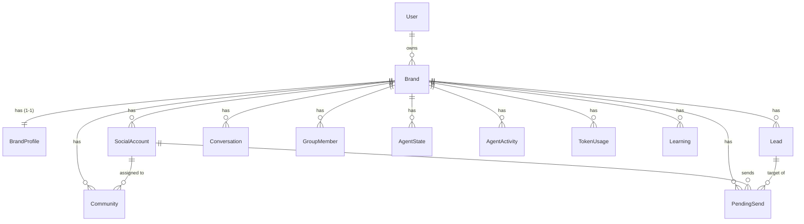

# Agent Layer — Prisma Schema Plan

> **Status:** PROPOSAL for review. Nothing in `schema.prisma` has been changed yet.
> This document describes the new tables, enums, and relationships needed to back
> the five-agent squad (Search, Research, Talk, Sales, **Leader — not yet built**)
> with Postgres, replacing the current file-based JSON store in
> `packages/Agents/agents/lib/store.py`.

Sources this plan is derived from:

- `packages/Agents/Implentation.md` (the authoritative spec — §5.3 "the bus", §8 Leader, §9 outbound state machine, §11 guardrails, §12 observability)
- `packages/Agents/agents/schemas/{search,research,talk,sales}.py` (the exact Pydantic field shapes)
- `packages/Agents/agents/lib/{store,guardrails,config}.py` (the current file-store contract)

---

## 1. Design principles

1. **Integrate, don't replace.** The existing auth models (`User`, `Session`,
   `Account`, `Verification`) stay exactly as they are. The only change to an
   existing model is **adding back-relation fields** (e.g. `brands Brand[]` on
   `User`) — purely additive, nothing removed.
2. **`brand_id` is the tenant key.** Every agent record is scoped by brand. Today
   the agents use a string `brand_id = "default"`; in Postgres `Brand` becomes a
   real table and `brandId` becomes a UUID FK. (See migration note §6.)
3. **Idempotent natural keys.** The store contract is "re-running a worker never
   creates duplicates." Every table keeps the natural unique key the file store
   uses today (`@@unique`), so upserts stay idempotent:
   - `leads` → `(brandId, userId)`
   - `communities` → `(brandId, handle)`
   - `group_members` → `(brandId, userId, groupChatId)`
   - `conversations` → `(brandId, userId, groupChatId, ts)`
   - `pending_sends` → `(brandId, dedupKey)`
   - `agent_state` → `(brandId, agentType)`
4. **Agents coordinate only through these tables** (Implentation.md §1). No
   agent-to-agent messaging — the schema *is* the bus.
5. **Follow existing schema conventions:** `String @id @default(uuid())`,
   `@@map("snake_case")` table names, `createdAt`/`updatedAt`, `@@index` on FKs.

### ⚠️ Naming collision to resolve

The auth schema **already has a model named `Account`** (better-auth OAuth
accounts). The agent layer's "accounts" are something completely different —
the **Telegram/Discord sending accounts** the gateway operates (the things that
get `activate`/`pause`/`restricted`, have per-account daily DM caps, and get
communities assigned to them).

**Proposed name: `SocialAccount`** (mapped to table `social_account`) to avoid
the clash. Flagged as an open question in §7.

---

## 2. New enums

```prisma
enum Platform            { telegram  discord }
enum SocialAccountStatus { active    paused      restricted }

enum LeadStatus    { new  prospect  nurturing  cold  lost  converted }
enum LeadSource    { talk inbound   outbound }
enum InterestLevel { hot  warm      cool       skip }

enum CommunityStatus { pending_join  joined  rejected }

enum AgentType      { leader  search  research  talk  sales }
enum AgentRunStatus { idle    running error }

enum PendingSendStatus { queued  sent  failed }
```

These mirror the `Literal[...]` types in the Pydantic schemas exactly
(`LeadStatus`, `LeadSource`, `InterestLevel`, `CommunityStatus`, `SalesStage`).
Note: `SalesStage` (`qualify/present/objection/close`) is a per-DM conversation
position — proposed to live as an enum column on a future DM-thread table or be
left transient (see §7 open questions), not as its own table.

---

## 3. New tables

### 3.1 `Brand` — the tenant root
The hub every agent record hangs off. Holds the niche (used for relevance
scoring) and the active flag (the scheduler only runs the Leader for active
brands, Implentation.md §10).

| field | type | notes |
|---|---|---|
| id | String uuid PK | |
| ownerId | String FK→User | who owns this brand |
| name | String | |
| niche | String | brand niche, fed to Search/Research/Talk prompts |
| active | Boolean = true | scheduler gate |
| createdAt / updatedAt | DateTime | |

Relations: `owner User`, and 1-to-many to nearly everything below; 1-to-1 to `BrandProfile`.

### 3.2 `BrandProfile` — the Sales knowledge base (1-1 with Brand)
Backs `ProfileStore` / `BrandProfile` (sales.py). Everything the Sales LLM is
allowed to claim.

| field | type | notes |
|---|---|---|
| id | String uuid PK | |
| brandId | String **@unique** FK→Brand | one profile per brand |
| persona | String = "" | voice/tone |
| productSummary | String = "" | |
| pricing | String = "" | empty ⇒ never quote a price |
| conversionAction | String = "" | the single next step |
| objectionNotes | String = "" | |

### 3.3 `SocialAccount` — the platform sending accounts
The gateway-operated Telegram/Discord accounts. Backs `account_id`, account
health gating, and round-robin community assignment (Implentation.md §8, §11).

| field | type | notes |
|---|---|---|
| id | String uuid PK | |
| brandId | String FK→Brand | |
| platform | Platform = telegram | |
| externalId | String | the `account_id` the agents/gateway use |
| handle | String = "" | the account's own @handle |
| status | SocialAccountStatus = active | only `active` accounts may act |
| createdAt / updatedAt | DateTime | |

Unique: `(brandId, externalId)`. Relations: `communities Community[]` (assigned), `pendingSends PendingSend[]` (sender).

### 3.4 `Lead` — the shared lead bus (Talk + Research write, Sales updates)
Backs `LeadRecord` / `LeadStore` (talk.py). Dedup `(brandId, userId)`.
Adds `outreachStage` to drive the §9 outbound state machine (prospect→contacted
stages 0..3→cold) and `lastOutreachAt` (read by the follow-up sweep).

| field | type | notes |
|---|---|---|
| id | String uuid PK | |
| brandId | String FK→Brand | |
| userId | String | platform user id (dedup key with brandId) |
| username | String = "" | |
| score | Int = 0 | 0–100 |
| interestLevel | InterestLevel = cool | |
| status | LeadStatus = new | funnel position |
| source | LeadSource = talk | talk / inbound / outbound |
| note | String = "" | why flagged / last outcome |
| painPoints | String[] | scalar list (mainly Research) |
| recommendedApproach | String = "" | how to open (Research outbound) |
| sourceGroupChatId | String = "" | group first seen in |
| outreachStage | Int = 0 | **new** — §9 state machine 0..3 |
| lastOutreachAt | DateTime? | set by Sales; read by follow-up sweep |
| createdAt / updatedAt | DateTime | |

Unique: `(brandId, userId)`. Index: `(brandId, status)` for funnel queries.

### 3.5 `Community` — discovered groups (Search writes, gateway joins)
Backs `CommunityRecord` / `CommunityStore` (search.py). Dedup `(brandId, handle)`.
Adds `groupChatId` (set by gateway after it joins — links members to a community)
and `assignedAccountId` (the Leader's round-robin assignment).

| field | type | notes |
|---|---|---|
| id | String uuid PK | |
| brandId | String FK→Brand | |
| handle | String | @username / t.me link (dedup key with brandId) |
| name | String = "" | |
| nicheRelevance | Int = 0 | 0–100 |
| status | CommunityStatus = pending_join | search never joins |
| source | String = "search" | (only value today; kept as String) |
| foundVia | String = "llm" | "llm" or "regex" |
| sourceUrl | String = "" | |
| groupChatId | String = "" | **new** — set by gateway after join |
| assignedAccountId | String? FK→SocialAccount | **new** — §8 round-robin |
| createdAt / updatedAt | DateTime | |

Unique: `(brandId, handle)`. Index: `(brandId, status)`.

### 3.6 `Conversation` — inbound bus (gateway writes, Research reads)
Backs `ConversationRecord` / `ConversationStore` (research.py). Read-only to
agents. `ts` promoted from ISO string to a real `DateTime`.

| field | type | notes |
|---|---|---|
| id | String uuid PK | |
| brandId | String FK→Brand | |
| userId | String | who spoke |
| username | String = "" | |
| groupChatId | String = "" | |
| text | String | |
| ts | DateTime | when said |
| createdAt | DateTime | |

Unique: `(brandId, userId, groupChatId, ts)`. Index: `(brandId)`.

### 3.7 `GroupMember` — outbound prospect pool (gateway writes, Research reads)
Backs `GroupMemberRecord` / `GroupMemberStore` (research.py). Dedup
`(brandId, userId, groupChatId)`.

| field | type | notes |
|---|---|---|
| id | String uuid PK | |
| brandId | String FK→Brand | |
| userId | String | |
| username | String = "" | no username ⇒ Research skips |
| groupChatId | String = "" | group scraped from |
| bio | String = "" | for relevance scoring |
| activityNote | String = "" | |
| createdAt / updatedAt | DateTime | |

Unique: `(brandId, userId, groupChatId)`. Index: `(brandId)`.

### 3.8 `PendingSend` — outbound DM queue (Leader/outreach write, gateway delivers)
Backs the `pending_sends` bus (Implentation.md §5.3, §9). The Leader/outreach
state machine queues a DM; the gateway picks it up and delivers it. Every send
carries a dedup key so retries can't double-send (§11 idempotency).

| field | type | notes |
|---|---|---|
| id | String uuid PK | |
| brandId | String FK→Brand | |
| leadId | String FK→Lead | who it's going to |
| accountId | String FK→SocialAccount | which account sends it |
| message | String | the generated copy |
| stage | Int = 0 | outreach stage that produced it |
| status | PendingSendStatus = queued | queued → sent / failed |
| dedupKey | String | idempotency key |
| createdAt | DateTime | |
| sentAt | DateTime? | set by gateway on delivery |

Unique: `(brandId, dedupKey)`. Index: `(brandId, status)` for the gateway's queue poll.

### 3.9 `AgentState` — run status + the `is_running` guard
Backs `guardrails.set_state` / `is_running` and the dashboard (Implentation.md
§6, §12). Dedup `(brandId, agentType)`.

| field | type | notes |
|---|---|---|
| id | String uuid PK | |
| brandId | String FK→Brand | |
| agentType | AgentType | leader/search/research/talk/sales |
| status | AgentRunStatus = idle | running ⇒ double-run guard trips |
| currentTask | String = "" | shown on dashboard |
| startedAt | DateTime? | |
| updatedAt | DateTime | |

Unique: `(brandId, agentType)`.

### 3.10 `AgentActivity` — the activity feed (audit + rate-limit + dedup source)
Backs `record_activity`, and critically `count_actions_today` and
`seen_dedup_key` (guardrails.py). In the file store these scan a JSONL feed; in
Postgres we **promote `dedupKey` and `accountId` out of the `detail` JSON into
indexed columns** so the per-day rate counter and idempotency guard are real
indexed queries instead of full scans.

| field | type | notes |
|---|---|---|
| id | String uuid PK | |
| brandId | String FK→Brand | |
| agent | AgentType | |
| action | String | e.g. ACTION_SENT, ACTION_DECIDED |
| detail | Json? | full payload (API keys redacted, §12) |
| dedupKey | String? | promoted for `seen_dedup_key` |
| accountId | String? | promoted for per-account `count_actions_today` |
| ts | DateTime | |

Indexes: `(brandId, agent, action, ts)` for `count_actions_today`;
`(brandId, agent, action, dedupKey)` for `seen_dedup_key`.

### 3.11 `TokenUsage` — per-LLM-call cost log
Backs `token_usage.jsonl` (Implentation.md §5.1, §12).

| field | type | notes |
|---|---|---|
| id | String uuid PK | |
| brandId | String FK→Brand | |
| agent | AgentType | |
| model | String | the model string used |
| promptTokens / completionTokens / totalTokens | Int = 0 | |
| ts | DateTime | |

Index: `(brandId, ts)`.

### 3.12 `Learning` — Leader strategy notes
Backs `LeaderPlan.new_learnings` and the `learnings` bus (Implentation.md §5.3,
§8 `save_and_propagate_learnings`). Free-text strategy notes the Leader
accumulates per brand.

| field | type | notes |
|---|---|---|
| id | String uuid PK | |
| brandId | String FK→Brand | |
| text | String | |
| createdAt | DateTime | |

Index: `(brandId)`.

---

## 4. Relationships (ER overview)



Soft (non-FK) links worth noting:
- `Conversation.groupChatId` / `GroupMember.groupChatId` ↔ `Community.groupChatId`
  — the gateway sets the chat id on the community after joining. Could be promoted
  to a real FK later; left as a soft link for now because members/conversations
  can exist before a community row is reconciled.
- All `onDelete: Cascade` from `Brand` so deleting a brand tears down its data.

---

## 5. LangGraph checkpoint tables (NOT managed by Prisma)

The Leader uses `langgraph-checkpoint-postgres` (`PostgresSaver`) for durable
graph state (Implentation.md §2, §8). That library creates and owns its own
tables (`checkpoints`, `checkpoint_blobs`, `checkpoint_writes`, `checkpoint_migrations`)
via `PostgresSaver.setup()`.

**Recommendation:** do **not** model these in Prisma. Either let `PostgresSaver`
create them in the same database, or isolate them in a dedicated Postgres schema
(e.g. `langgraph`). Prisma should ignore them (they won't appear in `schema.prisma`,
and `prisma migrate` won't touch a separate schema). Flagged in §7.

---

## 6. Migration & rollout notes

- **`brand_id` string → UUID.** Agents currently pass `brand_id="default"`. When
  this lands, either (a) seed a `Brand` row whose id is used everywhere, or (b)
  keep a stable string slug column on `Brand` and have agents resolve slug→id.
  This affects `store.py` and every agent entry point — **agent-side change, out
  of scope for the schema itself**, but the schema should decide whether `Brand`
  needs a `slug String @unique` for backward compatibility. (Leaning: add `slug`.)
- **The store layer migrates table-by-table.** `store.py`'s repository classes
  (`CommunityStore`, `LeadStore`, …) are already shaped like DB repositories, so
  each can be swapped to Prisma queries without touching agent code (Implentation.md §5.3).
- **ISO-string timestamps → `DateTime`.** Fields like `created_at`, `ts`,
  `last_outreach_at` are ISO-8601 strings in Pydantic today; promoted to real
  `DateTime` columns here.
- **Prisma 7 / `prisma-client` generator** and the existing `postgresql`
  datasource are reused as-is. New models are purely additive.

---

## 7. Open questions for review

1. **`SocialAccount` naming** — OK to call the Telegram/Discord sending accounts
   `SocialAccount` (table `social_account`) to avoid colliding with the existing
   better-auth `Account`? Alternatives: `SenderAccount`, `PlatformAccount`,
   `AgentAccount`.
2. **`Brand.slug`** — add a `slug String @unique` so the agents' current string
   `brand_id` keeps working during migration, or do a hard cutover to UUIDs?
3. **Brand ownership** — is a brand owned by a single `User` (`ownerId` as
   modelled), or does it need a many-to-many membership/team table?
4. **DM threads / `SalesStage`** — Sales `history` and Talk `recent_messages` are
   passed inline by the gateway today and not persisted. Do we want a `Message` /
   `DmThread` table (which would also give `SalesStage` a home), or keep DM
   history owned by the gateway and out of this schema?
5. **LangGraph checkpoints** — confirm we let `PostgresSaver` own its tables in a
   separate schema rather than modelling them in Prisma (§5).
6. **`AgentActivity` retention** — the activity feed is also the rate-limit/dedup
   source. Do we want a retention/pruning policy, or is `(brandId, agent, action, ts)`
   indexing enough at expected volume?

---

## 8. Proposed schema (full additive block, for review)

> This is the exact Prisma to **append** to `schema.prisma`, plus one additive
> line on `User`. Provided so the relations and types can be reviewed precisely.
> Not yet written to the file.

```prisma
// ─── add to existing User model (back-relation only, nothing removed) ───
// brands Brand[]

enum Platform            { telegram  discord }
enum SocialAccountStatus { active    paused      restricted }
enum LeadStatus          { new       prospect    nurturing  cold  lost  converted }
enum LeadSource          { talk      inbound     outbound }
enum InterestLevel       { hot       warm        cool       skip }
enum CommunityStatus     { pending_join  joined  rejected }
enum AgentType           { leader    search      research   talk  sales }
enum AgentRunStatus      { idle      running     error }
enum PendingSendStatus   { queued    sent        failed }

model Brand {
  id        String   @id @default(uuid())
  ownerId   String
  name      String
  slug      String?  @unique
  niche     String   @default("")
  active    Boolean  @default(true)
  createdAt DateTime @default(now())
  updatedAt DateTime @updatedAt

  owner          User            @relation(fields: [ownerId], references: [id], onDelete: Cascade)
  profile        BrandProfile?
  socialAccounts SocialAccount[]
  leads          Lead[]
  communities    Community[]
  conversations  Conversation[]
  groupMembers   GroupMember[]
  pendingSends   PendingSend[]
  agentStates    AgentState[]
  activities     AgentActivity[]
  tokenUsages    TokenUsage[]
  learnings      Learning[]

  @@index([ownerId])
  @@map("brand")
}

model BrandProfile {
  id               String   @id @default(uuid())
  brandId          String   @unique
  persona          String   @default("")
  productSummary   String   @default("")
  pricing          String   @default("")
  conversionAction String   @default("")
  objectionNotes   String   @default("")
  createdAt        DateTime @default(now())
  updatedAt        DateTime @updatedAt

  brand Brand @relation(fields: [brandId], references: [id], onDelete: Cascade)

  @@map("brand_profile")
}

model SocialAccount {
  id         String              @id @default(uuid())
  brandId    String
  platform   Platform            @default(telegram)
  externalId String
  handle     String              @default("")
  status     SocialAccountStatus @default(active)
  createdAt  DateTime            @default(now())
  updatedAt  DateTime            @updatedAt

  brand        Brand         @relation(fields: [brandId], references: [id], onDelete: Cascade)
  communities  Community[]
  pendingSends PendingSend[]

  @@unique([brandId, externalId])
  @@index([brandId])
  @@map("social_account")
}

model Lead {
  id                  String        @id @default(uuid())
  brandId             String
  userId              String
  username            String        @default("")
  score               Int           @default(0)
  interestLevel       InterestLevel @default(cool)
  status              LeadStatus    @default(new)
  source              LeadSource    @default(talk)
  note                String        @default("")
  painPoints          String[]
  recommendedApproach String        @default("")
  sourceGroupChatId   String        @default("")
  outreachStage       Int           @default(0)
  lastOutreachAt      DateTime?
  createdAt           DateTime      @default(now())
  updatedAt           DateTime      @updatedAt

  brand        Brand         @relation(fields: [brandId], references: [id], onDelete: Cascade)
  pendingSends PendingSend[]

  @@unique([brandId, userId])
  @@index([brandId, status])
  @@map("lead")
}

model Community {
  id                String          @id @default(uuid())
  brandId           String
  handle            String
  name              String          @default("")
  nicheRelevance    Int             @default(0)
  status            CommunityStatus @default(pending_join)
  source            String          @default("search")
  foundVia          String          @default("llm")
  sourceUrl         String          @default("")
  groupChatId       String          @default("")
  assignedAccountId String?
  createdAt         DateTime        @default(now())
  updatedAt         DateTime        @updatedAt

  brand           Brand          @relation(fields: [brandId], references: [id], onDelete: Cascade)
  assignedAccount SocialAccount? @relation(fields: [assignedAccountId], references: [id], onDelete: SetNull)

  @@unique([brandId, handle])
  @@index([brandId, status])
  @@index([assignedAccountId])
  @@map("community")
}

model Conversation {
  id          String   @id @default(uuid())
  brandId     String
  userId      String
  username    String   @default("")
  groupChatId String   @default("")
  text        String
  ts          DateTime
  createdAt   DateTime @default(now())

  brand Brand @relation(fields: [brandId], references: [id], onDelete: Cascade)

  @@unique([brandId, userId, groupChatId, ts])
  @@index([brandId])
  @@map("conversation")
}

model GroupMember {
  id           String   @id @default(uuid())
  brandId      String
  userId       String
  username     String   @default("")
  groupChatId  String   @default("")
  bio          String   @default("")
  activityNote String   @default("")
  createdAt    DateTime @default(now())
  updatedAt    DateTime @updatedAt

  brand Brand @relation(fields: [brandId], references: [id], onDelete: Cascade)

  @@unique([brandId, userId, groupChatId])
  @@index([brandId])
  @@map("group_member")
}

model PendingSend {
  id        String            @id @default(uuid())
  brandId   String
  leadId    String
  accountId String
  message   String
  stage     Int               @default(0)
  status    PendingSendStatus @default(queued)
  dedupKey  String
  createdAt DateTime          @default(now())
  sentAt    DateTime?

  brand   Brand         @relation(fields: [brandId], references: [id], onDelete: Cascade)
  lead    Lead          @relation(fields: [leadId], references: [id], onDelete: Cascade)
  account SocialAccount @relation(fields: [accountId], references: [id], onDelete: Cascade)

  @@unique([brandId, dedupKey])
  @@index([brandId, status])
  @@index([leadId])
  @@index([accountId])
  @@map("pending_send")
}

model AgentState {
  id          String         @id @default(uuid())
  brandId     String
  agentType   AgentType
  status      AgentRunStatus @default(idle)
  currentTask String         @default("")
  startedAt   DateTime?
  updatedAt   DateTime       @updatedAt

  brand Brand @relation(fields: [brandId], references: [id], onDelete: Cascade)

  @@unique([brandId, agentType])
  @@map("agent_state")
}

model AgentActivity {
  id        String    @id @default(uuid())
  brandId   String
  agent     AgentType
  action    String
  detail    Json?
  dedupKey  String?
  accountId String?
  ts        DateTime  @default(now())

  brand Brand @relation(fields: [brandId], references: [id], onDelete: Cascade)

  @@index([brandId, agent, action, ts])
  @@index([brandId, agent, action, dedupKey])
  @@map("agent_activity")
}

model TokenUsage {
  id               String    @id @default(uuid())
  brandId          String
  agent            AgentType
  model            String
  promptTokens     Int       @default(0)
  completionTokens Int       @default(0)
  totalTokens      Int       @default(0)
  ts               DateTime  @default(now())

  brand Brand @relation(fields: [brandId], references: [id], onDelete: Cascade)

  @@index([brandId, ts])
  @@map("token_usage")
}

model Learning {
  id        String   @id @default(uuid())
  brandId   String
  text      String
  createdAt DateTime @default(now())

  brand Brand @relation(fields: [brandId], references: [id], onDelete: Cascade)

  @@index([brandId])
  @@map("learning")
}
```
